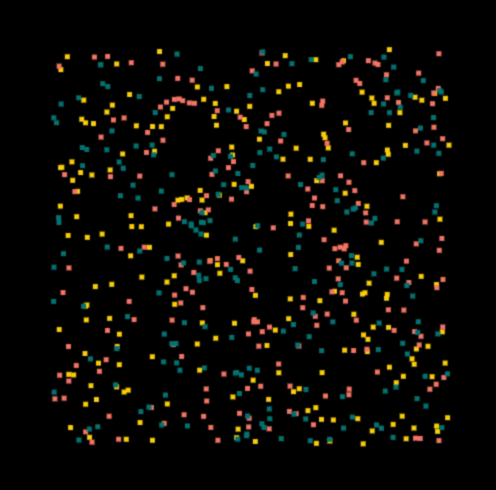

# Cellular Automata ䷾

Date: September 11, 2022

Why do silicon chips resemble cities?
Why dose the structure of neurons resemble the structure of the universe?
Why do the murmuring of starlings follow the same patterns as schools of fish?

The complexity of the natural world arises from a handful of natural laws and atomic elements.
The instructions of biological life are not inherently encoded into the universe.

Rather, life is an *emergent* phenomenon.

Amongst the interaction of matter and the laws that govern it, complexity spontaneously arises.

This concept can be roughly modeled with particle simulations.

In a simulation, entities- pixels, points, graphs, vertices, etc- are given a set of arbitrary rules.
These rules can spontaneously produce order out of a stochastic system.



```js
rule(green, green, -0.32);
rule(green, red, -0.17);
rule(green, yellow, 0.34);
rule(red, red, -0.1);
rule(red, green, -0.34);
rule(yellow, yellow, 0.15);
rule(yellow, green, -0.2);
```

Some of these organized entities, like in the GIF above, can demonstrate predictable self assembling patterns, mimicking how the natural world arises.

If you want to try running a particle simulator in your browser, check out [my Github for the code](https://github.com/ryansereno/particle-simulator)!

