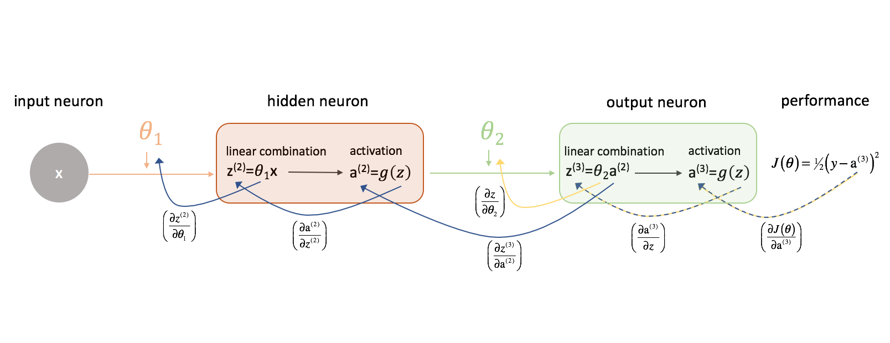

# Understanding The Core of ML Libraries ∂L/∂z

::: tip This article is a work in progress
:::

ML libraries like TensorFlow and PyTorch can feel overwhelming

But their core purpose is simple.

They have three primary functions:

- Create tensors and handle operations on them
- Calculate gradients
- Provide an optimizer (optional)

Here’s we will focus on the calculating of gradients as it is the core mechanism through which neural nets learn.

Neural network 'learning' involves incrementally adjusting the model's parameters, based on the gradient of the loss function.

These adjustments are made in the direction that *minimizes* the loss function, a process called gradient descent.

To derive these gradients, all operations and their inputs during the forward pass must be tracked so that their derivatives can be calculated during the backward pass. 

This process, known as backpropagation, uses the chain rule to efficiently compute these gradients.

… *Work in progress*
