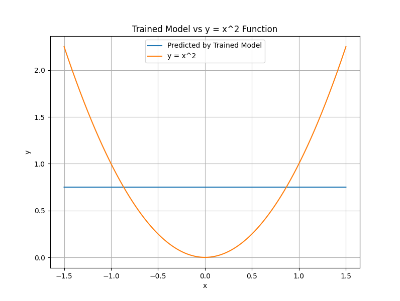
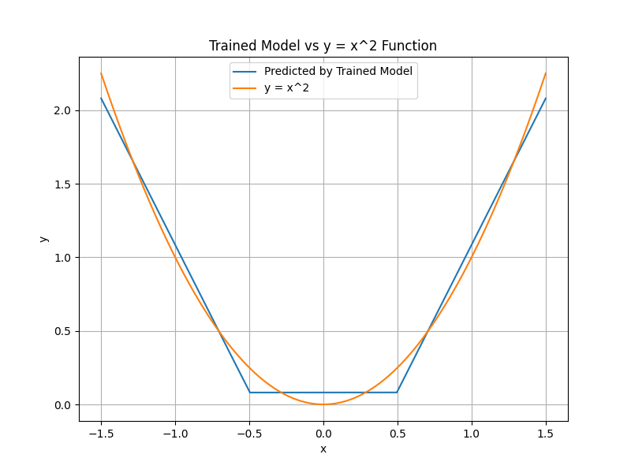
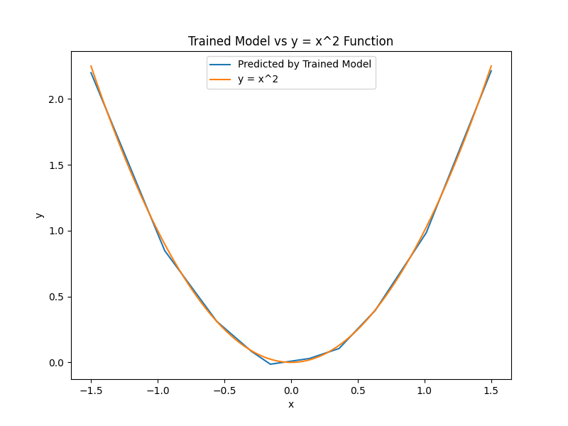

# Universal Function Approximators 𝒙²

Date: December 26, 2023

Neural networks are "universal function approximators".

But what does that mean?

Consider the graph of the function $y = x^2$

For any given input 'x', there is a definite, predictable output 'y' that precisely falls on the curve of the graph.
The function has a single, unchanging relationship between 'x' and 'y'

But there is a way to reproduce (approximate) something very close to this line, with a Neural Network.

While a neural network does not calculate this function directly, it can learn to approximate the curve of $y=x^2$ very closely through training.

---

Neural networks (NN's) can imitate the behavior of any continuous mathematical function.

A neural network is fundamentally just a large algebraic function, or rather a series of many linear functions chained together.

A 'neuron' is composed of a basic linear function $*N(x) = wx + b*$, or as you learned in algebra: $*y = mx + b*$

Because of this, these functions alone could only model linear data (straight lines)

A neural network composed of *only* linear functions could never model the non-linear $x^2$ function.
No matter how large the network or how long the training, the graph will always be a straight line:

Neural nets are able to model non linear data by using a non-linear activation function, such as ReLU, tanh, sigmoid, etc.

The ReLU (rectified linear unit) function is simple: it replaces all negative input values with zero. Mathematically, it can be expressed as:

$*ReLU(x) = MAX(x,0)*$

- If the input is greater than 0, it remains unchanged.
- If the input is less than or equal to 0, it is set to 0.

Passing the linear function into the non-linear activation function, creates a *neuron*:
$*N(x) = ReLU(wx + b)*$

Adding the ReLU to only two of the neurons in this neural network yields this graph:

Non-linear activation functions like ReLU allow the line to "bend", hence the name *non-linear*.

Each ReLU/ neuron introduces one "bend" in the line of the function graph.

A simplified but inuitive explanation is that a nerual network with *n* ReLU neurons, will be able to express up to *n + 1* linear line segments in its function graph.

Adding additional ReLU neurons adds additional line segments; the line becomes less linear and models the $x^2$ function more closely:

ReLU introduces an element of non-linearity into the network, needed to model non-linear data.
Without the ReLU, or other non-linear activation, the network could only ever model linear data.

Since the forward pass of a neural network is fundamentally just an algebraic function, it can be written out.
A simple 4 neuron neural network would look like:

$$
y = w_{11}^{[3]}ReLU\left(w_{11}^{[2]}ReLU(w_{11}^{[1]}x + b_{1}^{[1]}) +
w_{12}^{[2]}ReLU(w_{21}^{[1]}x + b_{2}^{[1]}) + b_{1}^{[2]}\right) +
w_{21}^{[3]}ReLU\left(w_{21}^{[2]}ReLU(w_{11}^{[1]}x + b_{1}^{[1]}) + w_{22}^{[2]}ReLU(w_{21}^{[1]}x + b_{2}^{[1]}) + b_{2}^{[2]}\right) + b_{1}^{[3]}
$$

Where:

- $x$ is the input to the network
- $\text{ReLU}(x) = \max(0, x)$
- $W^{[1]}$ and $b^{[1]}$ as the weights and biases of the first layer
- $W^{[2]}$ and $b^{[2]}$ as the weights and biases of the second layer
- $W^{[3]}$ and $b^{[3]}$ as the weights and biases of the third layer
- $y$ is the output of the model

Once trained, the above function can effectively approximate $y = x^2$, or any other continuous function, hence the name “universal approximator”

Training is outside of the scope of this post, but in simple terms it means finding the W and b values that result in an accurate approximation of the target.

---

Limitations:
Because a neural network functions as an approximator, it is only capable of estimating outputs based on the range and distribution of the data encountered during training. In this case, training involved passing in 100,000 (x, y) pairs derived from the continuous function $y=x^2$

If an input x is outside of the range seen during training, the neural network's prediction for the corresponding y output is based on extrapolation. This means the network is making an informed prediction rather than calculating an exact output, which can result in less accurate estimations for inputs that differ significantly from the training data.
